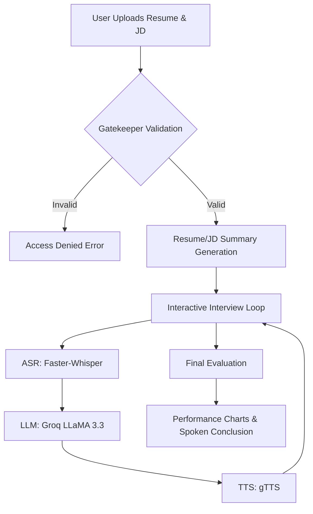

# 🧔 AI Interview Coach: Next-Gen Career Preparation

Elevate your career preparation with a sophisticated, AI-driven interview simulation. The **AI Interview Coach** leverages high-performance Large Language Models (LLMs) and local Speech-to-Text inference to provide a hyper-realistic, low-latency, and insightful practice environment.

---

## 🚀 Key Innovation: The Smart Gatekeeper
Unlike generic AI tools, our coach includes a **Technical Resume & JD Validator**. 
- **Automatic Validation**: Before the session begins, the system verifies if the uploaded PDF is a legitimate Resume and if the description provided is a valid Job Requirement.
- **Access Control**: Nonsensical documents or random text inputs are immediately flagged, preventing credit waste and ensuring a professional simulation.

## ✨ Advanced Features

### 🎙️ Immersive Voice Interaction
- **Real-time Transcription**: Powered by `Faster-Whisper` (Standard tiny model) for millisecond-latency speech recognition.
- **Autonomous Conversationalist**: The AI doesn't just ask questions; it listens and follows up based on your previous answers using LLaMA 3.3 70B.
- **HR Conclusion**: At the end of the session, receive a spoken summary of your performance in a neutral, professional HR tone.

### 📊 Professional-Grade Analytics
- **Color-Coded Feedback**:
  - <span style="color: #92fe9d; font-weight: bold;">[STRENGTHS]</span>: Highlighting where you excelled.
  - <span style="color: #ff4b4b; font-weight: bold;">[WEAKNESSES]</span>: Pinpointing specific gaps in knowledge or delivery.
  - <span style="color: #ffcc00; font-weight: bold;">[NOT READY YET]</span>: Topics where you need more hands-on experience.
- **Interactive Radar Maps**: Visualize your competency across Communication, Technical Depth, Problem Solving, Confidence, and Cultural Fit.
- **Industry Benchmarking**: Compare your calculated scores against live peer benchmarks for your specific role.

### 🌘 Premium Design System
- **Glassmorphic UI**: A custom-built dark interface with cyan and green accents.
- **Responsive Layout**: Seamlessly transitions from high-resolution desktop monitors to mobile devices.
- **Interactive HR Character**: A fixed on-screen coach that tracks mouse movements and provides helpful tips via a FAQ chat bubble.

---

## 🛠️ Architecture & Tech Stack



- **Frontend**: Gradio (Custom CSS/JS injected for premium dark theme).
- **Core Intelligence**: Groq API (LLaMA-3.3-70B-Versatile for extreme speed).
- **Audio Processing**: Faster-Whisper (In-IDE local inference).
- **PDF Extraction**: PyPDF2.
- **Data Viz**: Plotly.

---

## ⚙️ Detailed Setup Guide

### 1. Prerequisites
- **Python**: 3.10 or 3.11 recommended.
- **FFmpeg**: Required for audio processing. Install via `brew install ffmpeg` (Mac) or `choco install ffmpeg` (Windows).

### 2. Installation
```bash
# Clone the repo
git clone https://github.com/coder-apr-5/Interview_Coach.git
cd Interview_Coach

# Create environment
python -m venv venv
./venv/Scripts/activate  # Windows

# Install wheels first for audio (optional but recommended)
pip install setuptools wheel

# Install core requirements
pip install -r requirements.txt
```

### 3. Configuration
Create a `.env` file:
```env
GROQ_API_KEY=gsk_your_key_here
```

### 4. Running the App
```bash
python myapp.py
```
Wait for `Pre-loading Whisper model...` and `Whisper ready.` before starting your first session for the best experience.

---

## 👨‍💻 Developed By

**Apurba Roy**
A Full-Stack Developer and AI Enthusiast focused on building high-impact utility tools.

- [LinkedIn](https://linkedin.com/in/apurba-roy05)
- [GitHub](https://github.com/coder-apr-5)
- [Portfolio/Mail](mailto:apurbaroy.leo5@gmail.com)

---
© 2026 AI Interview Coach • **Prepare with Intelligence.**
